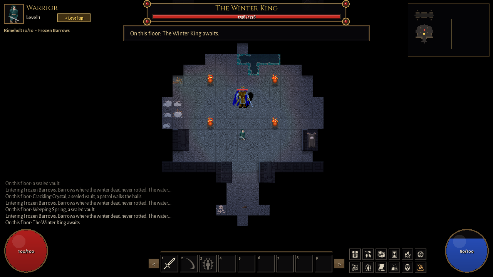
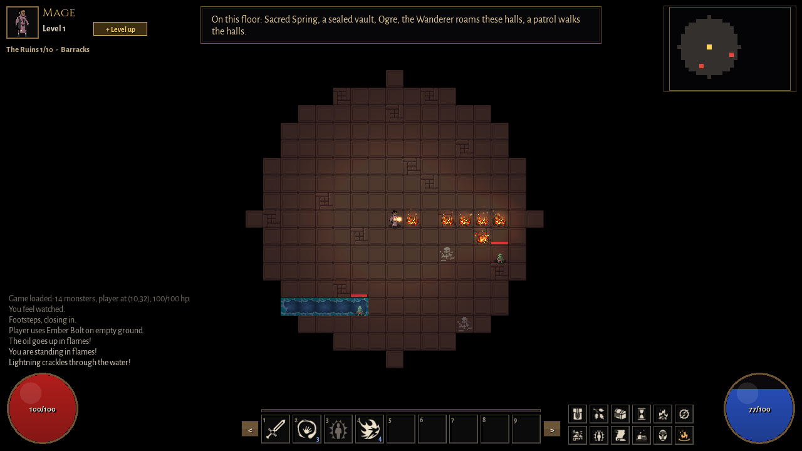
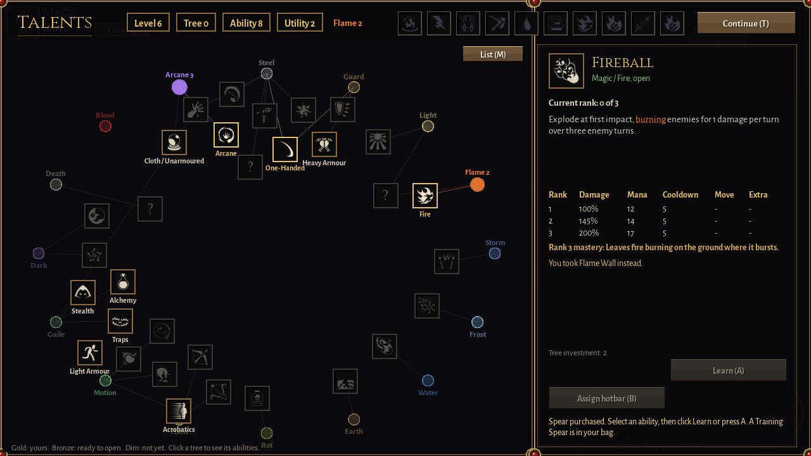
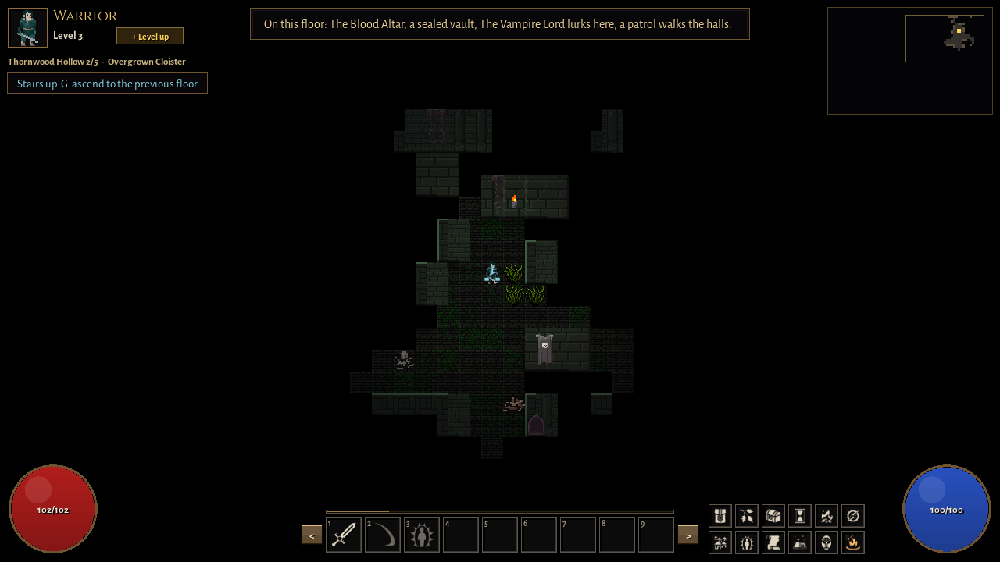
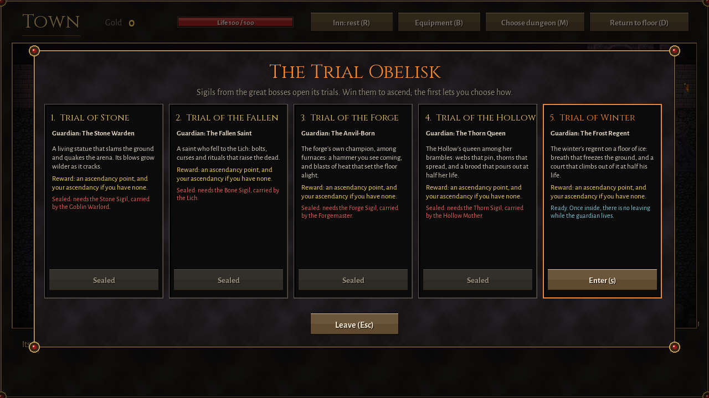

# Barrowlight

A turn-based, one-life roguelike RPG in a gothic world of layered dungeons,
written from scratch in C++17 with SFML 3. No game engine, no frameworks: the
turn scheduler, field of view, pathfinding, dungeon generation, talent system,
AI, saving and UI are all built here.



You build a character by discovering how talent trees, gear and ascendancies
combine, then decide how deep you dare to go. Danger is telegraphed, darkness
and the ground beneath you are weapons, and death is permanent.

**[DESIGN.md](DESIGN.md)** explains how and why it is built the way it is: the
game's systems, the engine's architecture, and a log of the major decisions,
including the ideas that were tried and replaced.

## Features

- **Six dungeons, 46 floors.** The Ruins and the Deep Crypts lead to the
  Lich. Three side dungeons (the Drowned Cathedral, the Ashen Foundry,
  Thornwood Hollow) are opened by things you find. Beyond the Lich, Rimeholt
  takes the run to level 30.
- **Floors built from modules.** A 3×3 grid of hand-made and procedural
  cells, at least half of them around a landmark event: shrines, hoards,
  caged prisoners, a chained demon, crystals that crack when struck, breaches
  that open when touched.
- **Readable, tactical combat.** An energy-based turn scheduler, and heavy
  attacks that are telegraphed with a reaction window. You fight with
  darkness and light (monsters differ in how they see), and with surfaces
  that combine: oil burns, water conducts, cold freezes, thorns cut.
- **47 talent trees and 16 colours.** Every tree forks twice. Each node adds
  a colour point, and colours open hybrid trees, deep trees found through
  lore, 34 hidden resonances, and 12 ascendancies earned in trials.
- **Systems that remember.** Floors persist when you leave them. A foe you
  flee becomes a named nemesis that follows you down. The Vampire Lord's
  bite curses you. Four gods each want something different.
- **48 monster kinds, from 7 AI behaviours.** Monsters are data plus
  pluggable behaviour objects, never subclasses.
- **Built-in tools.** A sandbox (spawn anything, max a character out,
  travel anywhere), an Encounter Lab, and a playtest bot.

| | |
|---|---|
|  |  |
|  |  |

## Building

Requirements: **CMake 3.28+**, a **C++17 compiler** and **Git**. Developed and
tested with MSVC 2022 on Windows; the code uses only standard C++ and SFML, with
no platform-specific APIs. SFML 3.1.0 is downloaded and built automatically by
CMake's FetchContent; there is nothing else to install on Windows or macOS.

```bash
cmake -S . -B build
cmake --build build --config Release
```

The first configure takes a few minutes while SFML builds. On Linux, SFML
needs a few system development packages first:

```bash
sudo apt install build-essential cmake git libxrandr-dev libxcursor-dev libxi-dev \
    libudev-dev libfreetype-dev libharfbuzz-dev libgl1-mesa-dev libegl1-mesa-dev
```

**Run it from the project root**, where `assets/` is:

```bash
./build/bin/Release/barrowlight    # Visual Studio / Xcode (multi-config)
./build/bin/barrowlight            # Ninja / Makefiles (single-config)
```

In Visual Studio the debugger's working directory is already set to the
project root.

### A standalone package

To make a zip anyone can unpack and play (Windows: just `barrowlight.exe`,
its assets and this README, with no Visual C++ redistributable needed):

```bash
cmake -S . -B build-dist -DBARROWLIGHT_PORTABLE=ON
cmake --build build-dist --config Release --target barrowlight
cd build-dist && cpack -C Release
```

This writes `build-dist/Barrowlight-1.0.0-Windows.zip`. `BARROWLIGHT_PORTABLE`
links the C++ runtime statically; SFML is always linked statically. The game
saves next to the executable.

## Playing

On the first screen, pick an origin: **1** Warrior, **2** Mage or **3** Thief.
**M** toggles Adventure mode (two spare lives), **S** starts a sandbox run and
**L** the Encounter Lab.

| Key | Action |
|---|---|
| Arrows / WASD | Move, or attack by walking into a foe |
| 1–9, mouse | Use an ability from the hotbar; aim with the mouse or arrows, confirm with Enter or a click |
| Tab | Cycle through visible foes |
| I | Inspect enemies |
| Space | Wait a turn |
| G | Pick up, open, use what's at your feet; read lore |
| C | Cleanse poison, burn, chill and marks |
| L | Light or put out your torch |
| R | Rest until healed (interrupted by danger) |
| Z | Auto-explore |
| H | Waystone to town (needs ten quiet turns) |
| T / B | Talent trees / inventory |
| M | Talent map (on the talent screen) |
| J | Journal: the lore you've found |
| F5 / F9 | Save / load |
| Esc | Pause menu |
| F1 | Sandbox panel (sandbox runs only) |

Hover over almost anything for a tooltip: abilities, statuses, items, foes,
keywords in descriptions.

## Tests

```bash
cd build
ctest -C Release              # everything (about a minute in Release)
ctest -C Release -LE slow     # skip the long integration suite
```

- **19 console tests** check the rules without a window: formulas, the turn
  scheduler, FOV, A*, dungeon generation, talents, AI and saving.
- **2 application tests** (about 1,200 checks) play the real game through a
  hidden window, and write render snapshots to `build/rewards-checks/`.
- The **playtest bot** (`build/bin/<Config>/playtest_bot [runs] [--seed N]`)
  plays whole runs and writes a report to `build/playtest/`. Use it as a
  crash check.

## Layout

```
src/
  core/       Application (the game, split by system), UI kit, sprites, sound, saving, turn scheduler
  entities/   actors, talents and the talent catalogue, monsters, items, statuses, progression
  world/      map, field of view, pathfinding, dungeon generation, modules, landmarks, surfaces
  ai/         monster behaviours: Chaser, Kiter, Support, AoE Bomber, Boss, Lich
tests/        console tests, application tests, the playtest bot, fixtures
assets/       sprites, icons, fonts, sounds and music (credits in assets/sprites/CREDITS.txt)
tools/        sfx_build.py: builds the sound effect families
```

`engine_core` (entities, world, ai, saving) never links SFML: the build
enforces that the rules stay independent of rendering. See
[DESIGN.md](DESIGN.md#22-layers).

## Credits

Code: Arya Singh. Art, fonts and sounds are from openly licensed packs (CC0
and CC-BY, including the Dungeon Crawl Stone Soup tiles and Calciumtrice's
sprites); full attributions are in `assets/sprites/CREDITS.txt`,
`assets/sounds/CREDITS.txt`, `assets/music/CREDITS.txt` and the font licences
in `assets/fonts/`.
